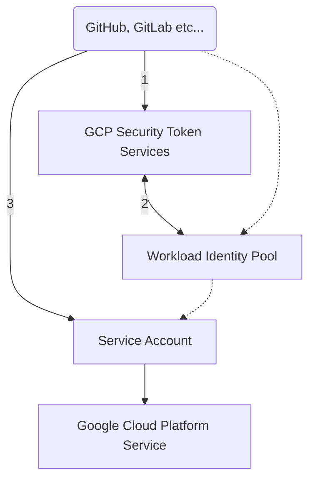

# Workload Identity Federation

Service account keys are a security risk if compromised.
Avoid service account keys and instead use the [Workload Identity Federation](https://cloud.google.com/iam/docs/workload-identity-federation).
You can learn more about the best way to authenticate service accounts on Google Cloud in this repo.

Unlike JSON service account keys, Workload Identity Federation generates short-lived OAuth 2.0 or JWT credentials.
By default, these credentials automatically expire one hour after they are created,
potentially reducing the time a malicious actor would be able to exploit a compromised credential.

Because Workload Identity Federation uses short-lived credentials, there are no secrets to rotate or manage beyond the initial configuration.

---

---

## How-tos

* :octocat: **[Set up Identity Federation for GitHub Actions](./github.md)**
* 🦊 **[Set up Identity Federation for GitLab CI](./gitlab.md)**
* **[Settings in Google Cloud Console](./console.md)**

> If you have understood the concept, you can also use my Terraform modules:
> * [Google Cloud Workload Identity for GitHub](https://registry.terraform.io/modules/Cyclenerd/wif-github/google/latest)
> * [Google Cloud Workload Identity for GitLab](https://registry.terraform.io/modules/Cyclenerd/wif-gitlab/google/latest)
> * [Allow Login via WIF for Service Accounts](https://registry.terraform.io/modules/Cyclenerd/wif-service-account/google/latest)
>
> This makes the setup much faster and automated.

## Disable Service Account Keys

You can disabled the key creation for service accounts via the organization policy constraint: `constraints/iam.disableServiceAccountKeyCreation`

This organization policy constraint is not mandatory, but with it you can be sure that no one will create new service account keys and Workload Identity Federation will be used.

## License

All files in this repository are under the [Apache License, Version 2.0](LICENSE) unless noted otherwise.

Portions of this repository are modifications based on work created and shared by [Google](https://developers.google.com/readme/policies)
and used according to terms described in the [Creative Commons 4.0 Attribution License](https://creativecommons.org/licenses/by/4.0/).

Please note:

* No warranty
* No official Google product
