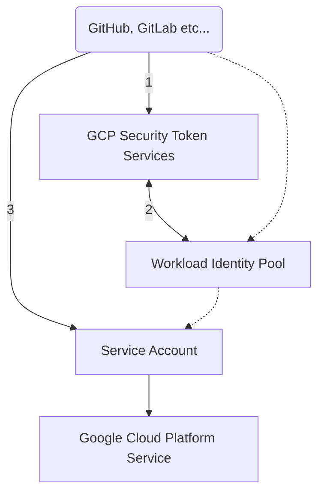
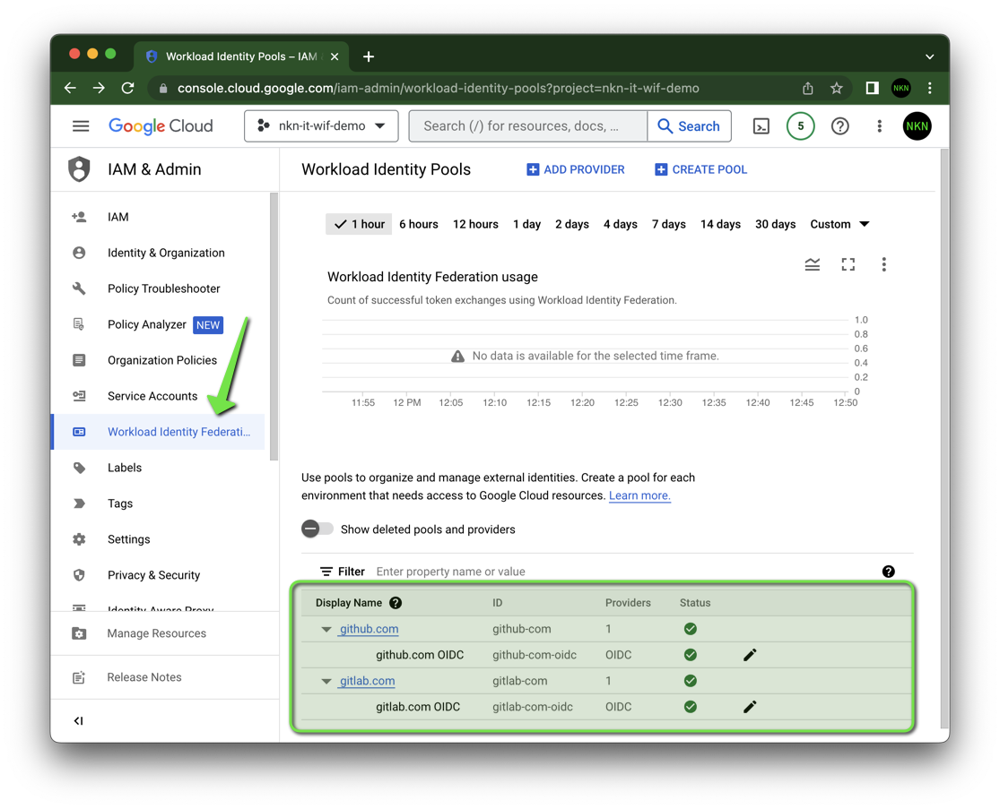
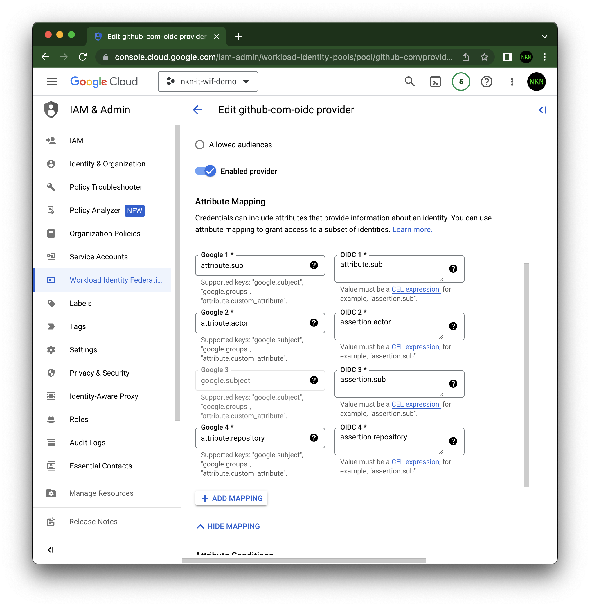
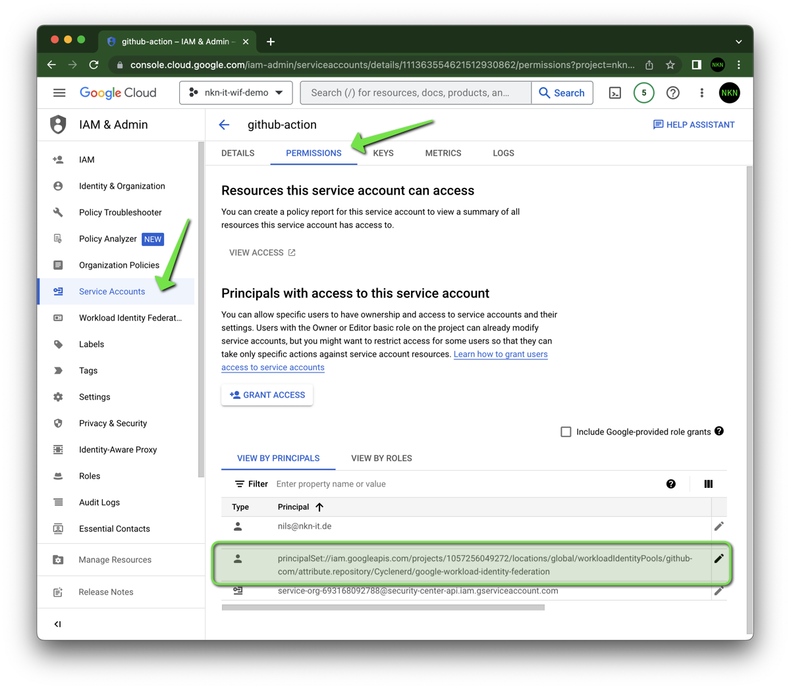

# Workload Identity Federation

[](#readme)
[](https://github.com/Cyclenerd/google-workload-identity-federation/tree/master/allow/examples#readme)
[](#set-up-identity-federation-for-github-action)
[](#set-up-identity-federation-for-gitlab-ci)

Service account keys are a security risk if compromised.
Avoid service account keys and instead use the [Workload Identity Federation](https://cloud.google.com/iam/docs/configuring-workload-identity-federation).
You can learn more about the best way to authenticate service accounts on Google Cloud in this repo.

> If you have understood the concept, you can also use my Terraform modules:
> * [Google Cloud Workload Identity for GitHub](https://registry.terraform.io/modules/Cyclenerd/wif-github/google/latest)
> * [Google Cloud Workload Identity for GitLab](https://registry.terraform.io/modules/Cyclenerd/wif-gitlab/google/latest)
> * [Allow Login via WIF for Service Accounts](https://registry.terraform.io/modules/Cyclenerd/wif-service-account/google/latest)
>
> This makes the setup much faster and automated.

Quick link to the tutorial for...
* :octocat: [GitHub](#set-up-identity-federation-for-github-action)
* 🦊 [GitLab](#set-up-identity-federation-for-gitlab-ci)

---



---

Unlike JSON service account keys, Workload Identity Federation generates short-lived OAuth 2.0 or JWT credentials. By default, these credentials automatically expire one hour after they are created, potentially reducing the time a malicious actor would be able to exploit a compromised credential.

Because Workload Identity Federation uses short-lived credentials, there are no secrets to rotate or manage beyond the initial configuration.


## Set up Identity Federation for GitHub Actions

Run in the following [Google Cloud CLI](https://cloud.google.com/sdk/docs/install) commands...

Set project (replace `YOUR-GOOGLE-CLOUD-PROJECT-ID` with your project ID):
```bash
gcloud config set project YOUR-GOOGLE-CLOUD-PROJECT-ID
```

Enable APIs:
```bash
gcloud services enable iam.googleapis.com
gcloud services enable sts.googleapis.com
gcloud services enable iamcredentials.googleapis.com
```

Create a Workload Identity Pool:
```bash
gcloud iam workload-identity-pools create "github-com" \
--location="global" \
--display-name="github.com"
```

Create a Workload Identity Provider in that pool:
```bash
gcloud iam workload-identity-pools providers create-oidc "github-com-oidc" \
--location="global" \
--workload-identity-pool="github-com" \
--display-name="github.com OIDC" \
--attribute-mapping="google.subject=assertion.sub,attribute.sub=assertion.sub,attribute.actor=assertion.actor,attribute.repository=assertion.repository" \
--issuer-uri="https://token.actions.githubusercontent.com"
```

Attribute mapping:

| Attribute              | Claim                  |
|------------------------|------------------------|
| `google.subject`       | `assertion.sub`        |
| `attribute.sub`        | `assertion.sub`        |
| `attribute.actor`      | `assertion.actor`      |
| `attribute.repository` | `assertion.repository` |

Get the full ID of the Workload Identity Pool:
```bash
gcloud iam workload-identity-pools describe "github-com" \
--location="global" \
--format="value(name)"
```

Save this value as an environment variable:
```bash
export WORKLOAD_IDENTITY_POOL="..." # value from above
```

Save your GitHub repository as an environment variable:
```bash
export REPOSITORY="username/name" # i.e. "Cyclenerd/google-workload-identity-federation"
```

Save the service account ID (email) as an environment variable:
```bash
export SERVICE_ACCOUNT_EMAIL="MY-SERVICE-ACCOUNT-NAME@MY-PROJECT_ID.iam.gserviceaccount.com."
```

Allow authentications from the Workload Identity Provider originating from your repository to impersonate the Service Account:
```bash
gcloud iam service-accounts add-iam-policy-binding "$SERVICE_ACCOUNT_EMAIL" \
--role="roles/iam.workloadIdentityUser" \
--member="principalSet://iam.googleapis.com/${WORKLOAD_IDENTITY_POOL}/attribute.repository/${REPOSITORY}"
```

> **Warning**
> Setting the correct `principalSet` with `attribute.repository` is very important.
> This is the only way to avoid that all GitHub repositories can authenticate!

> **Note**
> You can also secure it even more by using the attributes `attribute.sub` instead.
> Instead of the Repsoitory name you can use the Subject (`sub`).
> Example for GitHub: `repo:octo-org/octo-repo:environment:prod`

Extract the Workload Identity Provider resource name:
```bash
gcloud iam workload-identity-pools providers describe "github-com-oidc" \
--location="global" \
--workload-identity-pool="github-com" \
--format="value(name)"
```

Copy this name for your GitHub Actions configuration and add it to `workload_identity_provider`.

**GitHub Actions:**

An example of a working GitHub Actions configuration can be found [here](https://github.com/Cyclenerd/google-workload-identity-federation/blob/master/.github/workflows/auth.yml) ([`.github/workflows/auth.yml`](https://github.com/Cyclenerd/google-workload-identity-federation/blob/master/.github/workflows/auth.yml)).

**More Help:**

* [Google GitHub Actions repo](https://github.com/google-github-actions/auth#setup)
* [Troubleshooting](https://github.com/google-github-actions/auth/blob/main/docs/TROUBLESHOOTING.md)
* [Google Blog](https://cloud.google.com/blog/products/identity-security/enabling-keyless-authentication-from-github-actions)
* [Google Documentation](https://cloud.google.com/iam/docs/configuring-workload-identity-federation#github-actions)

### GitHub OIDC token

```json
{
  "jti": "example-id",
  "sub": "repo:octo-org/octo-repo:environment:prod",
  "environment": "prod",
  "aud": "https://github.com/octo-org",
  "ref": "refs/heads/main",
  "sha": "example-sha",
  "repository": "octo-org/octo-repo",
  "repository_owner": "octo-org",
  "actor_id": "12",
  "repository_id": "74",
  "repository_owner_id": "65",
  "run_id": "example-run-id",
  "run_number": "10",
  "run_attempt": "2",
  "actor": "octocat",
  "workflow": "example-workflow",
  "head_ref": "",
  "base_ref": "",
  "event_name": "workflow_dispatch",
  "ref_type": "branch",
  "job_workflow_ref": "octo-org/octo-automation/.github/workflows/oidc.yml@refs/heads/main",
  "iss": "https://token.actions.githubusercontent.com",
  "nbf": 1632492967,
  "exp": 1632493867,
  "iat": 1632493567
}
```
Source: [GitHub OIDC token documentation](https://docs.github.com/en/actions/deployment/security-hardening-your-deployments/about-security-hardening-with-openid-connect#understanding-the-oidc-token)


## Set up Identity Federation for GitLab CI

Run in the following [Google Cloud CLI](https://cloud.google.com/sdk/docs/install) commands...

Set project (replace `YOUR-GOOGLE-CLOUD-PROJECT-ID` with your project ID):
```bash
gcloud config set project YOUR-GOOGLE-CLOUD-PROJECT
```

Enable APIs:
```bash
gcloud services enable iam.googleapis.com
gcloud services enable sts.googleapis.com
gcloud services enable iamcredentials.googleapis.com
```

Create a Workload Identity Pool:
```bash
gcloud iam workload-identity-pools create "gitlab-com" \
--location="global" \
--display-name="gitlab.com"
```

Create a Workload Identity Provider in that pool:
```bash
gcloud iam workload-identity-pools providers create-oidc "gitlab-com-oidc" \
--location="global" \
--workload-identity-pool="gitlab-com" \
--display-name="gitlab.com OIDC" \
--attribute-mapping="google.subject=assertion.sub,attribute.sub=assertion.sub,attribute.actor=assertion.actor,attribute.repository=assertion.project_path" \
--issuer-uri="https://gitlab.com" \
--allowed-audiences="https://gitlab.com"
```

> **Note**
> Issuer URL `issuer-uri` and allowed audiences `allowed-audiences` must be `https://gitlab.com`.

Attribute mapping:

| Attribute              | Claim                                                 |
|------------------------|-------------------------------------------------------|
| `google.subject`       | `assertion.sub`                                       |
| `attribute.sub`        | `assertion.sub`                                       |
| `attribute.actor`      | `assertion.actor`                                     |
| `attribute.repository` | `assertion.project_path` (not `assertion.repository`) |

Get the full ID of the Workload Identity Pool:
```bash
gcloud iam workload-identity-pools describe "gitlab-com" \
--location="global" \
--format="value(name)"
```

Save this value as an environment variable:
```bash
export WORKLOAD_IDENTITY_POOL="..." # value from above
```

Save your GitHub repository as an environment variable
```bash
export REPOSITORY="username/name" # i.e. "Cyclenerd/google-workload-identity-federation-for-gitlab"
```

Save the service account ID (email) as an environment variable:
```bash
export SERVICE_ACCOUNT_EMAIL="MY-SERVICE-ACCOUNT-NAME@MY-PROJECT_ID.iam.gserviceaccount.com."
```

Allow authentications from the Workload Identity Provider originating from your repository to impersonate the Service Account:
```bash
gcloud iam service-accounts add-iam-policy-binding "$SERVICE_ACCOUNT_EMAIL" \
--role="roles/iam.workloadIdentityUser" \
--member="principalSet://iam.googleapis.com/${WORKLOAD_IDENTITY_POOL}/attribute.repository/${REPOSITORY}"
```

> **Warning**
> Setting the correct `principalSet` with `attribute.repository` is very important.
> This is the only way to avoid that all GitLab repositories can authenticate!

> **Note**
> You can also secure it even more by using the attributes `attribute.sub` instead.
> Instead of the Repsoitory name you can use the Subject (`sub`).
> Example for GitLab: `project_path:mygroup/myproject:ref_type:branch:ref:main`

Extract the Workload Identity Provider resource name:
```bash
gcloud iam workload-identity-pools providers describe "gitlab-com-oidc" \
--location="global" \
--workload-identity-pool="gitlab-com" \
--format="value(name)"
```

Copy this name for your GitLab CI configuration (`gitlab-ci.yml`).

**GitLab CI:**

An example of a working GitLab CI configuration can be found [here](.gitlab-ci.yml) ([`.gitlab-ci.yml`](.gitlab-ci.yml)) or on [GitLab](https://gitlab.com/Cyclenerd/google-workload-identity-federation-for-gitlab/-/blob/master/.gitlab-ci.yml).

**More Help:**

* [GitLab Documentation](https://docs.gitlab.com/ee/ci/cloud_services/google_cloud/)
* [GitLab OpenID Connect in GCP repo](https://gitlab.com/guided-explorations/gcp/configure-openid-connect-in-gcp)

### GitLab OIDC Token

```json
{
  "jti": "c82eeb0c-5c6f-4a33-abf5-4c474b92b558",
  "iss": "https://gitlab.example.com",
  "aud": "https://gitlab.example.com",
  "iat": 1585710286,
  "nbf": 1585798372,
  "exp": 1585713886,
  "sub": "project_path:mygroup/myproject:ref_type:branch:ref:main",
  "namespace_id": "1",
  "namespace_path": "mygroup",
  "project_id": "22",
  "project_path": "mygroup/myproject",
  "user_id": "42",
  "user_login": "myuser",
  "user_email": "myuser@example.com",
  "pipeline_id": "1212",
  "pipeline_source": "web",
  "job_id": "1212",
  "ref": "auto-deploy-2020-04-01",
  "ref_type": "branch",
  "ref_protected": "true",
  "environment": "production",
  "environment_protected": "true"
}
```
Source: [GitLab OIDC token documentation](https://docs.gitlab.com/ee/ci/cloud_services/index.html#how-it-works)


## Google Cloud Console

In Google Cloud Console, you can check the settings at the following locations.

### Workload Identity Pools



### Workload Identity Provider Attribute Mapping



### Service Account Permissions




## Disable Service Account Keys

You can disabled the key creation for service accounts via the organization policy constraint: `constraints/iam.disableServiceAccountKeyCreation`

This organization policy constraint is not mandatory, but with it you can be sure that no one will create new service account keys and Workload Identity Federation will be used.


## License

All files in this repository are under the [Apache License, Version 2.0](LICENSE) unless noted otherwise.

Please note:

* No warranty
* No official Google product
