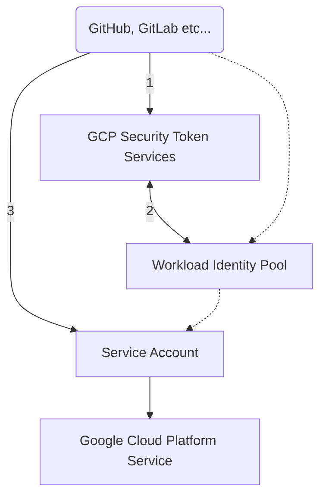

# Workload Identity Federation

[](#readme)
[](#set-up-identity-federation-for-github-action)
[](#set-up-identity-federation-for-gitlab-ci)

Service account keys are a security risk if compromised.
Avoid service account keys and instead use the [Workload Identity Federation](https://cloud.google.com/iam/docs/configuring-workload-identity-federation).
You can learn more about the best way to authenticate service accounts on Google Cloud here.

* :octocat: [GitHub](#set-up-identity-federation-for-github-action)
* 🦊 [GitLab](#set-up-identity-federation-for-gitlab-ci)

---



---

Unlike JSON service account keys, Workload Identity Federation generates short-lived OAuth 2.0 or JWT credentials. By default, these credentials automatically expire one hour after they are created, potentially reducing the time a malicious actor would be able to exploit a compromised credential.

Because Workload Identity Federation uses short-lived credentials, there are no secrets to rotate or manage beyond the initial configuration.

## Set up Identity Federation for GitHub Action

Run in Google Cloud Shell:
```bash
gcloud config set project YOUR-GOOGLE-CLOUD-PROJECT
```

Enable the IAM Credentials API:
```bash
gcloud services enable iamcredentials.googleapis.com \
--project="$GOOGLE_CLOUD_PROJECT"
```

Create a Workload Identity Pool:
```bash
gcloud iam workload-identity-pools create "github" \
--project="$GOOGLE_CLOUD_PROJECT" \
--location="global" \
--display-name="GitHub Action"
```

Create a Workload Identity Provider in that pool:
```bash
gcloud iam workload-identity-pools providers create-oidc "action" \
--project="$GOOGLE_CLOUD_PROJECT" \
--location="global" \
--workload-identity-pool="github" \
--display-name="GitHub Action OIDC" \
--attribute-mapping="google.subject=assertion.sub,attribute.actor=assertion.actor,attribute.repository=assertion.repository" \
--issuer-uri="https://token.actions.githubusercontent.com"
```

Get the full ID of the Workload Identity Pool:
```bash
gcloud iam workload-identity-pools describe "github" \
--project="$GOOGLE_CLOUD_PROJECT" \
--location="global" \
--format="value(name)"
```

Save this value as an environment variable:
```bash
export WORKLOAD_IDENTITY_POOL_ID="..." # value from above
```

Save your GitHub repository as an environment variable
```bash
export REPO="username/name" # e.g. "Cyclenerd/google-workload-identity-federation"
```

Save the service account ID (email) as an environment variable:
```bash
export MY_SERVICE_ACCOUNT_EMAIL="my-service-account@PROJECT_ID.iam.gserviceaccount.com."
```

Allow authentications from the Workload Identity Provider originating from your repository to impersonate the Service Account:
```bash
gcloud iam service-accounts add-iam-policy-binding "$MY_SERVICE_ACCOUNT_EMAIL" \
--project="$GOOGLE_CLOUD_PROJECT" \
--role="roles/iam.workloadIdentityUser" \
--member="principalSet://iam.googleapis.com/${WORKLOAD_IDENTITY_POOL_ID}/attribute.repository/${REPO}"
```

> **Warning**
> Setting the correct `principalSet` with `attribute.repository` is very important.
> This is the only way to avoid that all GitHub repositories can authenticate!

Extract the Workload Identity Provider resource name:
```bash
gcloud iam workload-identity-pools providers describe "action" \
--project="$GOOGLE_CLOUD_PROJECT" \
--location="global" \
--workload-identity-pool="github" \
--format="value(name)"
```

Copy this name for your GitHub Action and add it to `workload_identity_provider`.

GitHub Action:

An example of a working GitHub Action configuration can be found [here](https://github.com/Cyclenerd/google-workload-identity-federation/blob/master/.github/workflows/auth.yml) (`.github/workflows/auth.yml`).


More Help:

* [Google GitHub Action repo](https://github.com/google-github-actions/auth#setup)
* [Troubleshooting](https://github.com/google-github-actions/auth/blob/main/docs/TROUBLESHOOTING.md)
* [Google Blog](https://cloud.google.com/blog/products/identity-security/enabling-keyless-authentication-from-github-actions)
* [Google Documentation](https://cloud.google.com/iam/docs/configuring-workload-identity-federation#github-actions)

### GitHub OIDC token

```json
{
  "jti": "example-id",
  "sub": "repo:octo-org/octo-repo:environment:prod",
  "environment": "prod",
  "aud": "https://github.com/octo-org",
  "ref": "refs/heads/main",
  "sha": "example-sha",
  "repository": "octo-org/octo-repo",
  "repository_owner": "octo-org",
  "actor_id": "12",
  "repository_id": "74",
  "repository_owner_id": "65",
  "run_id": "example-run-id",
  "run_number": "10",
  "run_attempt": "2",
  "actor": "octocat",
  "workflow": "example-workflow",
  "head_ref": "",
  "base_ref": "",
  "event_name": "workflow_dispatch",
  "ref_type": "branch",
  "job_workflow_ref": "octo-org/octo-automation/.github/workflows/oidc.yml@refs/heads/main",
  "iss": "https://token.actions.githubusercontent.com",
  "nbf": 1632492967,
  "exp": 1632493867,
  "iat": 1632493567
}
```
» [GitHub OIDC token documentation](https://docs.github.com/en/actions/deployment/security-hardening-your-deployments/about-security-hardening-with-openid-connect#understanding-the-oidc-token)


## Set up Identity Federation for GitLab CI

> You can also do all the following steps with [Terraform](https://registry.terraform.io/providers/hashicorp/google/latest/docs), using the [`gitlab-setup.tf`](./gitlab-setup.tf) file as an example.

Run in Google Cloud Shell:
```bash
gcloud config set project YOUR-GOOGLE-CLOUD-PROJECT
```

Enable the IAM Credentials API:
```bash
gcloud services enable iamcredentials.googleapis.com \
--project="$GOOGLE_CLOUD_PROJECT"
```

Create a Workload Identity Pool:
```bash
gcloud iam workload-identity-pools create "gitlab" \
--project="$GOOGLE_CLOUD_PROJECT" \
--location="global" \
--display-name="GitLab CI"
```

Create a Workload Identity Provider in that pool:
```bash
gcloud iam workload-identity-pools providers create-oidc "cicd" \
--project="$GOOGLE_CLOUD_PROJECT" \
--location="global" \
--workload-identity-pool="gitlab" \
--display-name="GitLab CI OIDC" \
--attribute-mapping="google.subject=assertion.sub,attribute.actor=assertion.actor,attribute.project_path=assertion.project_path" \
--issuer-uri="https://gitlab.com" \
--allowed-audiences="https://gitlab.com"
```

> **Note**
> Issuer URL `issuer-uri` and allowed audiences `allowed-audiences` must be `https://gitlab.com`.

Get the full ID of the Workload Identity Pool:
```bash
gcloud iam workload-identity-pools describe "gitlab" \
--project="$GOOGLE_CLOUD_PROJECT" \
--location="global" \
--format="value(name)"
```

Save this value as an environment variable:
```bash
export WORKLOAD_IDENTITY_POOL_ID="..." # value from above
```

Save your GitHub repository as an environment variable
```bash
export REPO="username/name" # e.g. "Cyclenerd/google-workload-identity-federation"
```

Save the service account ID (email) as an environment variable:
```bash
export MY_SERVICE_ACCOUNT_EMAIL="my-service-account@PROJECT_ID.iam.gserviceaccount.com."
```

Allow authentications from the Workload Identity Provider originating from your repository to impersonate the Service Account:
```bash
gcloud iam service-accounts add-iam-policy-binding "$MY_SERVICE_ACCOUNT_EMAIL" \
--project="$GOOGLE_CLOUD_PROJECT" \
--role="roles/iam.workloadIdentityUser" \
--member="principalSet://iam.googleapis.com/${WORKLOAD_IDENTITY_POOL_ID}/attribute.project_path/${REPO}"
```

> **Warning**
> Setting the correct `principalSet` with `attribute.project_path` is very important.
> This is the only way to avoid that all GitLab repositories can authenticate!

Extract the Workload Identity Provider resource name:
```bash
gcloud iam workload-identity-pools providers describe "cicd" \
--project="$GOOGLE_CLOUD_PROJECT" \
--location="global" \
--workload-identity-pool="gitlab" \
--format="value(name)"
```

Copy this name for your GitHub Action and add it to `workload_identity_provider`.

GitLab CI:

An example of a working GitLab CI configuration can be found [here](.gitlab-ci.yml) (`.gitlab-ci.yml`) or on [GitLab](https://gitlab.com/Cyclenerd/google-workload-identity-federation-for-gitlab/-/blob/master/.gitlab-ci.yml).

More Help:

* [GitLab Documentation](https://docs.gitlab.com/ee/ci/cloud_services/google_cloud/)
* [GitLab OpenID Connect in GCP repo](https://gitlab.com/guided-explorations/gcp/configure-openid-connect-in-gcp)

### GitLab OIDC Token

```json
{
  "jti": "c82eeb0c-5c6f-4a33-abf5-4c474b92b558",
  "iss": "https://gitlab.example.com",
  "aud": "https://gitlab.example.com",
  "iat": 1585710286,
  "nbf": 1585798372,
  "exp": 1585713886,
  "sub": "project_path:mygroup/myproject:ref_type:branch:ref:main",
  "namespace_id": "1",
  "namespace_path": "mygroup",
  "project_id": "22",
  "project_path": "mygroup/myproject",
  "user_id": "42",
  "user_login": "myuser",
  "user_email": "myuser@example.com",
  "pipeline_id": "1212",
  "pipeline_source": "web",
  "job_id": "1212",
  "ref": "auto-deploy-2020-04-01",
  "ref_type": "branch",
  "ref_protected": "true",
  "environment": "production",
  "environment_protected": "true"
}
```

» [GitLab OIDC token documentation](https://docs.gitlab.com/ee/ci/cloud_services/index.html#how-it-works)


## License

All files in this repository are under the [Apache License, Version 2.0](LICENSE) unless noted otherwise.

Please note:

* No warranty
* No official Google product
