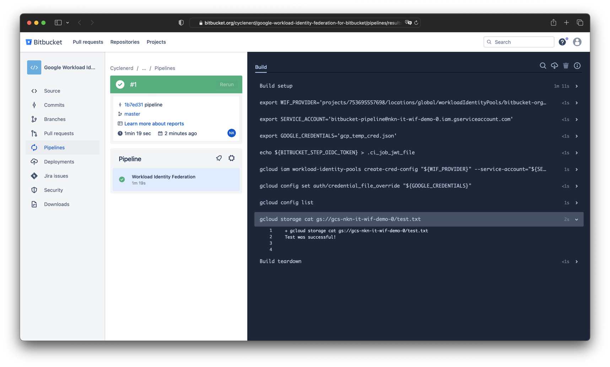

# Set up Identity Federation for Bitbucket

[](#)

## Bitbucket Repository Settings

Navigate to the Bitbucket repsoitory settings and click the menu item "OpenID Connect".

Here you will find the OIDC information:

* Identity provider URL
* Audience
* Repository UUID

Save the values as an environment variable:

```bash
export IDENTITY_PROVIDER_URL="..." # Identity provider URL from OpenID Connect setting
export IDENTITY_PROVIDER_AUDIENCE="..." # Audience value from OpenID Connect setting
export REPOSITORY="..." # Repository UUID from OpenID Connect setting
```

Example with values for `cyclenerd/google-workload-identity-federation-for-bitbucket` repository:

```bash
export IDENTITY_PROVIDER_URL="https://api.bitbucket.org/2.0/workspaces/cyclenerd/pipelines-config/identity/oidc"
export IDENTITY_PROVIDER_AUDIENCE="ari:cloud:bitbucket::workspace/7baee083-4f25-4a97-8a9a-0fde1b623b45"
export REPOSITORY="{2e9e429c-7b8b-404f-8648-8c40c27c9ebd}"
```

## Create Workload Identity Pool

Run in the following [Google Cloud CLI](https://cloud.google.com/sdk/docs/install) commands...

Set project (replace `YOUR-GOOGLE-CLOUD-PROJECT-ID` with your project ID):

```bash
gcloud config set project YOUR-GOOGLE-CLOUD-PROJECT
```

Enable APIs:

```bash
gcloud services enable iam.googleapis.com
gcloud services enable sts.googleapis.com
gcloud services enable iamcredentials.googleapis.com
```

Create a Workload Identity Pool:

```bash
gcloud iam workload-identity-pools create "bitbucket-org" \
--location="global" \
--display-name="bitbucket.org"
```

Create a Workload Identity Provider in that pool:

```bash
gcloud iam workload-identity-pools providers create-oidc "bitbucket-org-oidc" \
--location="global" \
--workload-identity-pool="bitbucket-org" \
--display-name="bitbucket.org OIDC" \
--attribute-mapping="google.subject=assertion.sub,attribute.sub=assertion.sub,attribute.repository=assertion.repositoryUuid" \
--issuer-uri="$IDENTITY_PROVIDER_URL" \
--allowed-audiences="$IDENTITY_PROVIDER_AUDIENCE"
```

Attribute mapping:

| Attribute                         | Claim                             | Description |
|-----------------------------------|-----------------------------------|-------------|
| `google.subject`                  | `assertion.sub`                   | Subject
| `attribute.sub`                   | `assertion.sub`                   | Defines the subject claim that is to be validated by the cloud provider. This setting is essential for making sure that access tokens are only allocated in a predictable way.
| `attribute.repository`            | `assertion.repositoryUuid`        | The repository (UUID) from where the workflow is running

Get the full ID of the Workload Identity Pool:

```bash
gcloud iam workload-identity-pools describe "bitbucket-org" \
--location="global" \
--format="value(name)"
```

Save this value as an environment variable:

```bash
export WORKLOAD_IDENTITY_POOL="..." # value from above
```

Save the service account ID (email) as an environment variable:

```bash
export SERVICE_ACCOUNT_EMAIL="MY-SERVICE-ACCOUNT-NAME@MY-PROJECT_ID.iam.gserviceaccount.com."
```

Allow authentications from the Workload Identity Provider originating from your repository to impersonate the Service Account:

```bash
gcloud iam service-accounts add-iam-policy-binding "$SERVICE_ACCOUNT_EMAIL" \
--role="roles/iam.workloadIdentityUser" \
--member="principalSet://iam.googleapis.com/${WORKLOAD_IDENTITY_POOL}/attribute.repository/${REPOSITORY}"
```

> **Warning**
> Setting the correct `principalSet` with `attribute.repository` is very important.
> This is the only way to avoid that all Bitbucket repositories can authenticate!


## Bitbucket Pipeline

Extract the Workload Identity Provider resource name:

```bash
gcloud iam workload-identity-pools providers describe "bitbucket-org-oidc" \
--location="global" \
--workload-identity-pool="bitbucket-org" \
--format="value(name)"
```

Copy this name for your Bitbucket pipeline configuration (`bitbucket-pipelines.yml`).

An example of a working Bitbucket pipeline configuration can be found [here](bitbucket-pipelines.yml) ([`bitbucket-pipelines.yml`](bitbucket-pipelines.yml)) or on [Bitbucket](https://bitbucket.org/cyclenerd/google-workload-identity-federation-for-bitbucket/src/master/bitbucket-pipelines.yml).



**More Help:**

* [Integrate Pipelines with resource servers using OIDC](https://support.atlassian.com/bitbucket-cloud/docs/integrate-pipelines-with-resource-servers-using-oidc/)
* [Variables and secrets](https://support.atlassian.com/bitbucket-cloud/docs/variables-and-secrets/)

## Bitbucket OIDC Token

```json
{
	"sub": "{2e9e429c-7b8b-404f-8648-8c40c27c9ebd}:{stepUuid}",
	"aud": "ari:cloud:bitbucket::workspace/7baee083-4f25-4a97-8a9a-0fde1b623b45",
	"stepUuid": "{xxxxxxx-xxxx-xxxx-xxxx-xxxxxxxxxx}",
	"iss": "https://api.bitbucket.org/2.0/workspaces/cyclenerd/pipelines-config/identity/oidc",
	"repositoryUuid": "{2e9e429c-7b8b-404f-8648-8c40c27c9ebd}",
	"branchName": "xxxxxxxxx",
	"exp": "xxxxxxxxxx",
	"iat": "xxxxxxxxxx",
	"pipelineUuid": "{xxxxx-xxxxx-xxxx-xxxx-xxxxxxxxxxx}",
	"workspaceUuid": "{7baee083-4f25-4a97-8a9a-0fde1b623b45}"
}
```

Source: Bitbucket OpenID Connect (OIDC) repository settings