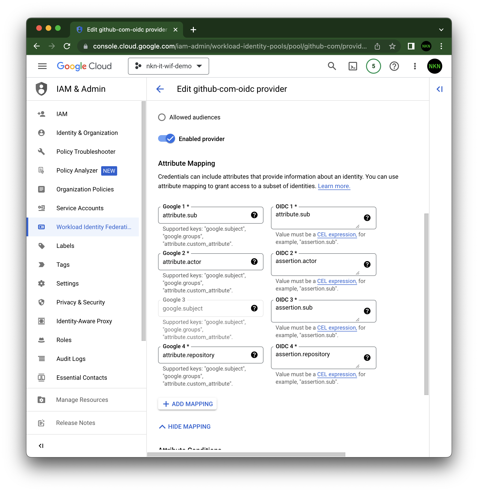
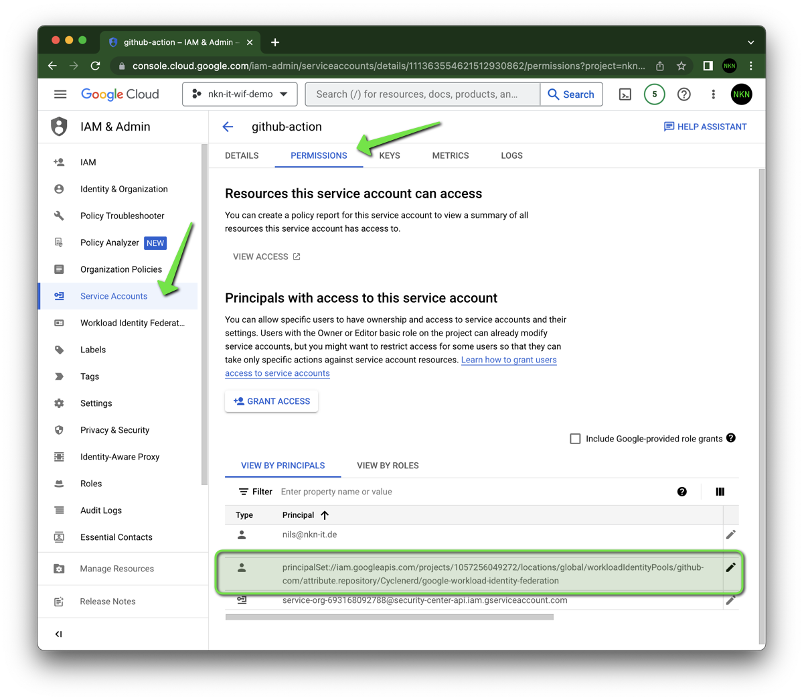

# Settings in Google Cloud Console

In Google Cloud Console, you can check the settings at the following locations.

## Workload Identity Pools

## Workload Identity Provider Attribute Mapping

## Service Account Permissions

